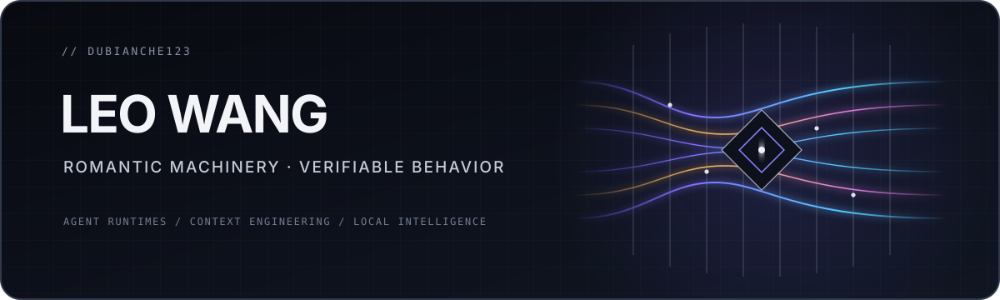

  

  I build the machinery beneath intelligent software: agent runtimes and context systems, 
  from cloud infrastructure to on-device intelligence. 
  I care about making probabilistic systems dependable without making their complexity the user's problem.

  <code>Agent Runtimes</code>&nbsp;&nbsp;·&nbsp;&nbsp;<code>Context Engineering</code>&nbsp;&nbsp;·&nbsp;&nbsp;<code>Cloud Architecture</code>&nbsp;&nbsp;·&nbsp;&nbsp;<code>On-Device Intelligence</code>

## What I'm building

I'm currently building **Axiom Loom**, a local-first agent runtime for continuous context, memory, and multi-agent orchestration.

The idea is simple: finite context windows should remain an implementation detail, not something users have to manage.

> **Rigorous underneath. Effortless in motion.**

## A few things I've built

| Project | What I was exploring |
|:--|:--|
| **[The Norn Machine](https://github.com/dubianche123/deterministic-context-assembly)** | A ritual-like interface built on deterministic context assembly. Code makes the judgment; the model renders it. |
| **[Neural-Janitor](https://github.com/dubianche123/device-native-tab-hygiene)** | A device-native tab hygiene engine that learns locally through Core ML rather than exporting personal behavior to the cloud. |
| **[Bounded Coding Delegation](https://github.com/dubianche123/bounded-coding-delegation)** | A local coding-agent helper with bounded review loops, process cleanup, and structured handoff. |

## How I work

I tend to put deterministic control wherever authority matters, keep personal data local when I can, and design architectures that can outlive any one provider. I like useful defaults more than walls of configuration, and I try to back the claims that matter with measurements.

That usually leaves me working at the point where models stop being demos and start becoming dependable software.
